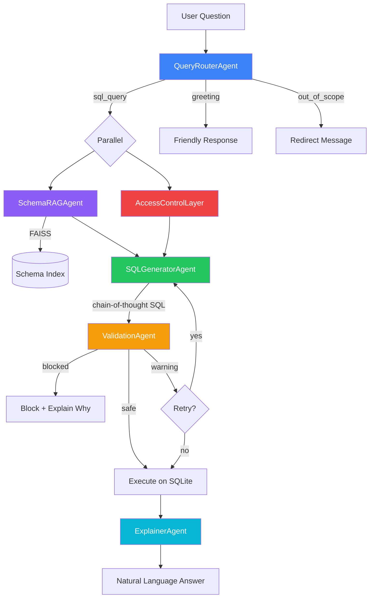

# rag-sql-agent

This is a small demo into my work at Flow. I have recreated parts of my production-grade multi-agent RAG system that converts natural language to SQL. The process is simplified, but the main process is the same. Here, six specialized agents collaborate through an async pipeline with role-based access control, chain-of-thought reasoning, and full observability.

Built with LangChain, FAISS, LiteLLM, and SQLite. Swappable LLM backend (OpenAI, Ollama, Anthropic) via config.


---

## Architecture



### Agent Responsibilities

| Agent | Role | LLM? |
|---|---|---|
| **QueryRouterAgent** | Classifies intent (sql_query, schema_info, greeting, out_of_scope) and complexity | Yes |
| **SchemaRAGAgent** | Retrieves relevant schema chunks via FAISS, synthesizes context | Yes |
| **AccessControlLayer** | Enforces role-based table permissions — deterministic, no hallucination risk | **No** |
| **SQLGeneratorAgent** | Generates SQLite SQL with visible chain-of-thought (understand → plan → construct → verify) | Yes |
| **ValidationAgent** | Two-pass audit: deterministic rules (blocked keywords, injection patterns, join limits) + LLM semantic check | Hybrid |
| **ExplainerAgent** | Translates query results into plain-English summaries with highlights | Yes |

---

## Why Naive RAG-SQL Fails in Production

A single "paste the schema + user question → get SQL" prompt works in demos. It breaks in real systems for five reasons:

1. **No access control.** There's no enforcement layer to prevent an analyst from querying PII tables. You need a deterministic gate that can't be prompt-injected.

2. **No pre-execution validation.** Malicious or malformed SQL (DROP, injection patterns, Cartesian joins) goes straight to the database. You need rule-based checks *before* execution, not after.

3. **Schema doesn't fit.** With 50+ tables, stuffing full DDL into context wastes tokens and confuses the model. RAG retrieval over chunked schema documentation surfaces only relevant context.

4. **Opaque failures.** When the answer is wrong, a single prompt gives you no signal about *where* it went wrong — was the question misunderstood? Was the schema context insufficient? Was the SQL syntactically wrong? Separate agents produce separate trace events.

5. **No reasoning chain.** Stakeholders can't trust a system that produces SQL from a black box. Explicit chain-of-thought (understand → plan → construct → verify) makes the system auditable.

---

## Example Queries

| # | Query | Expected Behavior |
|---|---|---|
| 1 | "Show me the top 10 transactions by amount" | Single-table SELECT, ORDER BY, LIMIT 10 |
| 2 | "How many transactions were flagged for fraud?" | COUNT with WHERE fraud_flag = 1 |
| 3 | "What's the average transaction amount by channel?" | GROUP BY channel, AVG(amount) |
| 4 | "Which merchants have the most transactions?" | JOIN transactions → merchants, GROUP BY, ORDER BY count |
| 5 | "Show me all pending transactions from the last 30 days" | WHERE status + date filter |
| 6 | "What's the total spending per merchant category?" | JOIN + GROUP BY category, SUM |
| 7 | "List accounts with balance over $50,000" | Single-table filter (requires analyst+ role) |
| 8 | "Show me user emails" (as analyst) | **Blocked** — analyst cannot access users table |
| 9 | "Show me user emails" (as admin) | Allowed — admin has full access |
| 10 | "DROP TABLE transactions" | **Blocked** — DDL detected by validation |
| 11 | "How many users are verified?" | Requires admin role; analyst gets access denied |
| 12 | "What's the refund rate by merchant?" | JOIN + conditional aggregation |
| 13 | "Show transactions where 1=1" | **Blocked** — injection pattern detected |
| 14 | "Hello!" | Greeting response, no SQL generated |
| 15 | "What's the weather?" | Out-of-scope response |
| 16 | "Monthly transaction volume trend" | GROUP BY strftime month, COUNT |
| 17 | "Largest single transaction this year" | ORDER BY + LIMIT 1 + date filter |
| 18 | "Compare online vs POS channel totals" | GROUP BY channel, SUM, filtered to two channels |
| 19 | "Which accounts have credit cards?" | WHERE account_type = 'credit' |
| 20 | "Show me the schema" | Returns full DDL, no SQL generation needed |

---

## Setup

### Prerequisites

- Python 3.11+
- An LLM backend: [Ollama](https://ollama.ai) (recommended for local) or an OpenAI/Anthropic API key

### Local (venv)

```bash
# Clone
git clone https://github.com/vitellaro-matteo/rag-sql-agent.git
cd rag-sql-agent

# Create venv
python -m venv .venv
source .venv/bin/activate  # Windows: .venv\Scripts\activate

# Install
pip install -e ".[dev]"

# Configure
cp .env.example .env
# Edit .env — set LLM_PROVIDER and LLM_MODEL

# Seed database + build FAISS index
python -m scripts.seed_db
python -m scripts.build_index

# If using Ollama, pull a model:
ollama pull llama3.1:8b

# Run CLI
python -m src.main

# Or run Streamlit UI
streamlit run src/ui/app.py
```

### Docker

```bash

# Start everything (app + Ollama)
docker compose up --build

# Pull a model into the Ollama container (first time only)
docker compose exec ollama ollama pull llama3.1:8b

# Open http://localhost:8501
```

### Run Tests (no API key needed)

```bash
# Local
pytest tests/ -v

# Docker
docker compose run --rm tests
```

---

## Project Structure

```
rag-sql-agent/
├── config/
│   ├── settings.yaml          # Central configuration (env var interpolation)
│   └── prompts/               # YAML prompt templates per agent
│       ├── router.yaml
│       ├── schema_rag.yaml
│       ├── sql_generator.yaml
│       ├── validation.yaml
│       └── explainer.yaml
├── src/
│   ├── core/
│   │   ├── config.py          # Pydantic settings + YAML loader
│   │   ├── logging.py         # structlog + AgentTrace
│   │   ├── llm.py             # LiteLLM wrapper + JSON parser
│   │   ├── database.py        # Async SQLite with safety guardrails
│   │   └── schema_store.py    # FAISS vector store over schema chunks
│   ├── agents/
│   │   ├── base.py            # Abstract agent with LLM call + trace
│   │   ├── router.py          # Intent classification
│   │   ├── schema_rag.py      # Schema retrieval + synthesis
│   │   ├── access_control.py  # Role-based permissions (no LLM)
│   │   ├── sql_generator.py   # Chain-of-thought SQL generation
│   │   ├── validation.py      # Two-pass SQL audit
│   │   ├── explainer.py       # Results → natural language
│   │   └── orchestrator.py    # Pipeline coordinator
│   ├── ui/
│   │   └── app.py             # Streamlit interface
│   └── main.py                # CLI entry point
├── scripts/
│   ├── seed_db.py             # Generate fake fintech data
│   └── build_index.py         # Build FAISS schema index
├── tests/
│   ├── conftest.py            # Fixtures + mocked LLM responses
│   ├── test_config.py
│   ├── test_database.py
│   ├── test_access_control.py
│   ├── test_validation.py
│   ├── test_agents.py
│   ├── test_llm.py
│   └── test_orchestrator.py
├── docs/
│   └── architecture.md        # Design decisions explained
├── data/                      # Generated at runtime (gitignored)
├── pyproject.toml
├── Dockerfile
├── docker-compose.yml
├── .env.example
└── .gitignore
```

---

## Scaling Considerations

| Concern | Current | Production Path |
|---|---|---|
| **Database** | SQLite (single file) | Postgres + asyncpg + connection pooling |
| **Vector store** | FAISS in-process | FAISS IVF, or managed (Pinecone, Weaviate) |
| **LLM calls** | Sequential per request | Request queue + rate limiting (LiteLLM native) |
| **Caching** | None | Redis for schema retrieval + repeated query results |
| **Auth** | UI dropdown | JWT/OAuth token → role extraction middleware |
| **Observability** | structlog to stderr | OTEL collector → Grafana/Datadog |
| **Concurrency** | Single async loop | Uvicorn workers behind a load balancer |
| **Schema changes** | Manual re-index | Webhook on DDL → auto re-index pipeline |

---

## License

MIT
